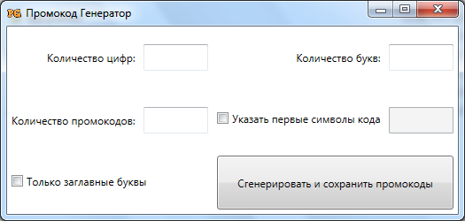

# PromoCodeGenerator
PromoCodeGenerator - это генератор промокодов для ваших промоакций.

PromoCodeGenerator может генерировать случайным образом неповторяющиеся промокоды из цифр и символов латинского алфавита. 
Вы можете указать общее количество символов и цифр, также можете указать начальные символы кода.

**Внимание!**
PromoCodeGenerator создает коды случайным образом и создает множество *уникальных* кодов. Общее количество кодов зависит 
от заданного количества символов и цифр и вычисляется по формуле [размещений с повторениями](https://ru.wikipedia.org/wiki/%D0%A0%D0%B0%D0%B7%D0%BC%D0%B5%D1%89%D0%B5%D0%BD%D0%B8%D0%B5#.D0.9A.D0.BE.D0.BB.D0.B8.D1.87.D0.B5.D1.81.D1.82.D0.B2.D0.BE_.D1.80.D0.B0.D0.B7.D0.BC.D0.B5.D1.89.D0.B5.D0.BD.D0.B8.D0.B9_.D1.81_.D0.BF.D0.BE.D0.B2.D1.82.D0.BE.D1.80.D0.B5.D0.BD.D0.B8.D1.8F.D0.BC.D0.B8).
Поэтому, если запрашиваемое число кодов близко к максимально возможному для данного набора символов, 
то генерация может длиться достаточно долго. В этом случае есть два выхода:
* увеличить количество символов в промокоде (*просто*);
* написать другой алгоритм генерации промокодов.

